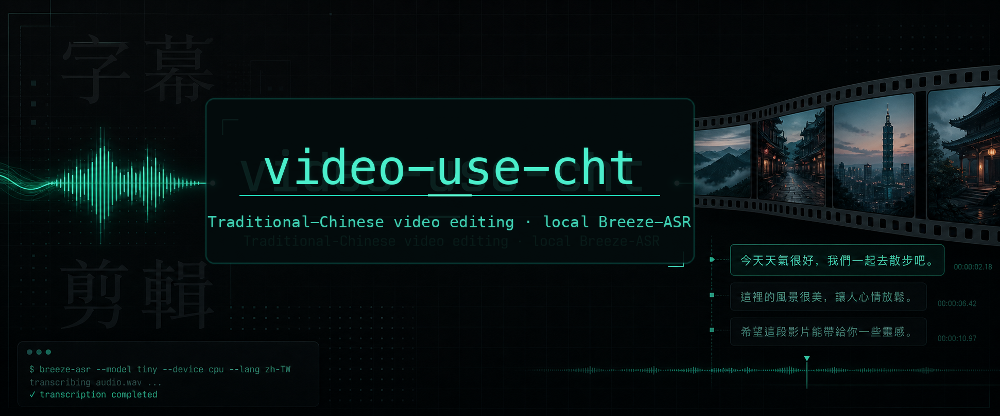

<p align="center">
  
</p>

# video-use-cht

**English** · [繁體中文](./README.zh-TW.md)

> ### 🍴 Fork of [browser-use/video-use](https://github.com/browser-use/video-use)
> A Traditional-Chinese / Taiwanese-Mandarin derivative that swaps the cloud
> **ElevenLabs Scribe** transcription backend for a **local [Breeze-ASR](https://huggingface.co/MediaTek-Research/Breeze-ASR-25) (via WhisperX)** pipeline.
> All credit for the original editor design goes to **Browser Use**; this fork only
> changes transcription. Independent project — **not** affiliated with or endorsed by
> Browser Use or MediaTek Research. See [Attribution & licenses](#attribution--licenses).

Better 中文 / 台語 / 中英 code-switch accuracy, runs on-device, no transcription API key. Everything downstream (packing, EDL, render, self-eval) is unchanged from upstream.

Drop raw footage in a folder, chat with Claude Code, get `final.mp4` back. Works for any content — talking heads, montages, tutorials, travel, interviews — without presets or menus.

## What it does

- **Cuts out filler words** and dead space between takes
- **Auto color grades** every segment (warm cinematic, neutral punch, or any custom ffmpeg chain)
- **30ms audio fades** at every cut so you never hear a pop
- **Burns subtitles** in your style — fully customizable
- **Generates animation overlays** via [HyperFrames](https://github.com/heygen-com/hyperframes), [Remotion](https://www.remotion.dev/), [Manim](https://www.manim.community/), or PIL — spawned in parallel sub-agents
- **Self-evaluates the rendered output** at every cut boundary before showing you anything
- **Persists session memory** in `project.md`

## What's different from upstream video-use

| | upstream video-use | **video-use-cht** |
|---|---|---|
| Transcription | ElevenLabs Scribe (cloud, paid) | **Breeze-ASR-25/26 via WhisperX (local, free)** |
| Word timestamps | Scribe native | **wav2vec2 forced alignment** |
| Diarization | Scribe built-in | **pyannote** (optional, needs HF token) |
| Best for | English | **台灣華語 / 台語 / 中英 code-switch** |
| API key | `ELEVENLABS_API_KEY` (required) | `HF_TOKEN` (optional, diarization only) |

### Which model? (中 / 英 / 台)

Pick per source with `--model`:

- **`breeze25`** (default) — Taiwanese Mandarin + English code-switch (**中 + 英**). Uses the prebuilt CTranslate2 weights [`SoybeanMilk/faster-whisper-Breeze-ASR-25`](https://huggingface.co/SoybeanMilk/faster-whisper-Breeze-ASR-25).
- **`breeze26`** / **`taigi`** — [BreezeASR-Taigi](https://huggingface.co/MediaTek-Research/Breeze-ASR-26): Taiwanese Hokkien + Mandarin (**台 + 中**), transcribed into Han characters. No public CT2 build yet — see [Breeze-ASR-26 setup](#breeze-asr-26-taigi-setup).

No single model is best at 中 + 英 + 台 at once, and you can't run both on the same audio. Default to `breeze25`; switch the Taigi-heavy clips to `breeze26`.

## Manual install

```bash
# 1. Clone and symlink into your agent's skills directory
git clone <your-fork-url> ~/Developer/video-use-cht
ln -sfn ~/Developer/video-use-cht ~/.claude/skills/video-use-cht     # Claude Code

# 2. Install deps (Python 3.10–3.12; torch/whisperx have no 3.13 wheels yet)
cd ~/Developer/video-use-cht
uv venv --python 3.12
uv pip install -e .             # whisperx + alignment + diarization + helpers
brew install ffmpeg             # required

# 3. (Optional) speaker diarization for multi-speaker footage
cp .env.example .env
$EDITOR .env                    # HF_TOKEN=...  (see token steps in .env.example)
```

Diarization uses a gated pyannote model. To enable it: create a token at
[huggingface.co/settings/tokens](https://huggingface.co/settings/tokens) and accept the
terms for [`pyannote/speaker-diarization-community-1`](https://huggingface.co/pyannote/speaker-diarization-community-1)
(pyannote.audio 4.x flagship pipeline). Without a token, transcription still runs and
everything is tagged `speaker_0`.

### Breeze-ASR-26 (Taigi) setup

ASR-26 ships only as Hugging Face weights, so transcode it to CTranslate2 once:

```bash
uv pip install -e ".[convert]"
ct2-transformers-converter --model MediaTek-Research/Breeze-ASR-26 \
  --output_dir ~/.cache/breeze-asr-26-ct2 --copy_files tokenizer.json --quantization int8
BREEZE_MODEL=~/.cache/breeze-asr-26-ct2 python helpers/transcribe.py clip.mp4
```

## Usage

```bash
cd /path/to/your/videos
claude    # or codex, hermes, etc.
```

> 把這些剪成一支發表影片

It inventories the sources, proposes a strategy, waits for your OK, then produces `edit/final.mp4`.

Transcribe manually / in batch:

```bash
python helpers/transcribe.py clip.mp4 --num-speakers 2          # single file, diarized
python helpers/transcribe.py clip.mp4 --model taigi --no-diarize
python helpers/transcribe_batch.py ./takes --num-speakers 2     # whole folder
```

## How it works

The LLM never watches the video. It **reads** it — through two layers that give it word-boundary precision.

**Layer 1 — Audio transcript (always loaded).** One Breeze-ASR pass per source (WhisperX: faster-whisper transcription → wav2vec2 alignment → pyannote diarization) gives word-level timestamps and speaker labels, emitted in a Scribe-compatible `words[]` schema. All takes pack into a single `takes_packed.md`.

**Layer 2 — Visual composite (on demand).** `timeline_view` produces a filmstrip + waveform + word labels PNG for any time range, only at decision points.

## Pipeline

```
Transcribe (Breeze/WhisperX) ──> Pack ──> LLM Reasons ──> EDL ──> Render ──> Self-Eval
                                                                                │
                                                                                └─ issue? fix + re-render (max 3)
```

## Design principles

1. **Text + on-demand visuals.** No frame-dumping. The transcript is the surface.
2. **Audio is primary, visuals follow.** Cuts come from speech boundaries and silence gaps.
3. **Ask → confirm → execute → self-eval → persist.**
4. **Zero assumptions about content type.** Look, ask, then edit.
5. **Production-correctness is non-negotiable. Taste isn't.**

See [`SKILL.md`](./SKILL.md) for the full production rules and editing craft.

## Why these choices (built with Claude Code)

This fork was designed and implemented interactively with [Claude Code](https://www.anthropic.com/claude-code). The key decisions, and the reasoning behind them:

- **Why a new ASR at all — Breeze-ASR.** Upstream's ElevenLabs Scribe is cloud, paid, and tuned for English. Breeze-ASR-25 is Whisper-large-v2 fine-tuned by MediaTek Research for *Taiwanese Mandarin + Mandarin-English code-switch* (~10% better CER, +56% code-switch vs vanilla Whisper), and Breeze-ASR-26 adds Taigi. Running it locally also makes transcription free and private.

- **Why WhisperX, not Breeze directly.** video-use has a hard rule: *word-level timestamps only* — it snaps every cut to a word boundary. But Whisper-family models (Breeze included) produce **jittery native word timestamps for Chinese**, because Chinese has no word boundaries and the timing is inferred from cross-attention. WhisperX runs the Breeze transcription through **wav2vec2 forced alignment**, giving far steadier per-character timing — and it bundles **pyannote diarization** in the same pass, covering speaker labels too. So WhisperX = Breeze's accuracy + reliable timestamps + diarization in one pipeline.

- **Why the "Scribe-compatible `words[]`" seam.** The transcription backend is the *only* thing this fork changes. Everything downstream (`pack_transcripts.py`, the EDL, render, self-eval) reads a single JSON `words[]` array. So the adapter ([`helpers/transcribe_breeze.py`](./helpers/transcribe_breeze.py)) maps WhisperX output into the exact same schema ElevenLabs Scribe emitted (`type`/`start`/`end`/`text`/`speaker_id`, synthesizing `spacing` entries and mapping `SPEAKER_00 → speaker_0`). That kept the diff tiny and left upstream's editing logic untouched.

- **Why pyannote `speaker-diarization-community-1`.** We first targeted `3.1`, but pyannote.audio 4.x pulls `community-1` artifacts even when you request 3.1 — so we pin `community-1` directly (its gated terms are what you accept).

- **Why CPU on Apple Silicon.** CTranslate2 (faster-whisper's engine) has no Metal/MPS path, so Breeze runs on CPU. For *offline* editing that's an acceptable trade for local + free; alignment and diarization can still use MPS.

- **The CJK packing fix.** WhisperX char-aligns Chinese (and even splits English into single letters), which made the packed transcript read as `大 家 好` / `v i d e o`. `pack_transcripts.py` now joins tokens CJK-aware: no space at any CJK boundary or between single ASCII chars, a space only between real multi-char latin words.

This was an iterative process — including real bugs found only by running it end-to-end (a renamed `token` kwarg, the `community-1` gating, the harmless `torchcodec` warning). The [Troubleshooting](#troubleshooting) table is the distilled result.

## Verify it works (no footage needed)

You can smoke-test the whole pipeline with a synthetic two-speaker clip made by
macOS `say` — useful to confirm install before you have real footage:

```bash
cd /tmp && mkdir -p vuc-test && cd vuc-test
say -v Meijia   -o s1.aiff "大家好，歡迎收看今天的節目，今天要來聊聊 AI 影片剪輯。"
say -v Tingting -o s2.aiff "對啊，我覺得這個 video 工具真的很方便。"
for f in s1 s2; do ffmpeg -y -i $f.aiff -ac 1 -ar 16000 $f.wav; done
ffmpeg -y -f lavfi -i anullsrc=r=16000:cl=mono -t 0.7 sil.wav
printf "file 's1.wav'\nfile 'sil.wav'\nfile 's2.wav'\n" > l.txt
ffmpeg -y -f concat -safe 0 -i l.txt -c copy conversation.wav

python ~/Developer/video-use-cht/helpers/transcribe.py conversation.wav --num-speakers 2
python ~/Developer/video-use-cht/helpers/pack_transcripts.py --edit-dir edit
cat edit/takes_packed.md
```

You should see Traditional-Chinese text with `S0`/`S1` speaker tags and `video`
preserved inline. (Two synthetic TTS voices are a *hard* case for diarization —
real, distinct human voices separate far better.)

## Troubleshooting

| Symptom | Cause / fix |
|---|---|
| `No matching distribution` / build errors on install | Python 3.13+ has no torch/whisperx wheels yet. Use `uv venv --python 3.12`. |
| `GatedRepoError: ... speaker-diarization-community-1 ... not in the authorized list` | Accept the gated terms at [the model page](https://huggingface.co/pyannote/speaker-diarization-community-1) with the **same** account as your `HF_TOKEN`, then re-run. pyannote.audio 4.x uses `community-1` even if you request the older `3.1`. |
| `torchcodec ... Could not load libtorchcodec` warning | **Harmless.** whisperx feeds audio to pyannote in-memory and never calls torchcodec. (It appears because Homebrew ships ffmpeg 8 while torchcodec wants 4–7.) |
| Transcription feels slow | Expected. CTranslate2 has no Metal/MPS path on Apple Silicon, so Breeze runs on CPU (~1.2× realtime). Fine for offline editing. First run also downloads ~3–4 GB of weights (once). |
| Filler words (`um`/`uh`) not getting cut | Whisper-family ASR (Breeze) tends to drop fillers, so transcript-driven filler removal is weaker than Scribe's verbatim mode. Silence-gap cutting is unaffected. |
| All speech tagged `speaker_0` | No `HF_TOKEN`, or you passed `--no-diarize`. Single-speaker footage stays `speaker_0` by design. |
| Chinese shows as spaced characters in older runs | Fixed — `pack_transcripts.py` now joins CJK without spaces. Re-run `pack_transcripts.py`. |

## Attribution & licenses

- Forked from **[browser-use/video-use](https://github.com/browser-use/video-use)** — MIT License. The original `LICENSE` is retained in this repo.
- Transcription uses **[MediaTek-Research/Breeze-ASR-25](https://huggingface.co/MediaTek-Research/Breeze-ASR-25)** and **[Breeze-ASR-26](https://huggingface.co/MediaTek-Research/Breeze-ASR-26)** — Apache 2.0.
- CT2 weights for ASR-25 from **[SoybeanMilk/faster-whisper-Breeze-ASR-25](https://huggingface.co/SoybeanMilk/faster-whisper-Breeze-ASR-25)**.
- Pipeline via **[WhisperX](https://github.com/m-bain/whisperX)** (BSD-2) and **[pyannote.audio](https://github.com/pyannote/pyannote-audio)** (MIT, gated weights).

**Changes from upstream:** replaced the ElevenLabs Scribe backend (`helpers/transcribe.py`) with a local Breeze-ASR/WhisperX backend (`helpers/transcribe_breeze.py`); updated `pyproject.toml`, `.env.example`, and this README accordingly. All other editing logic is upstream's.

**Built with [Claude Code](https://www.anthropic.com/claude-code).** The fork — backend swap, CJK packing fix, docs, and end-to-end testing — was implemented with Claude Code's help.
